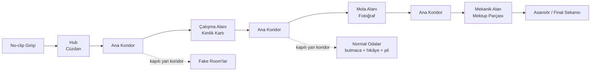
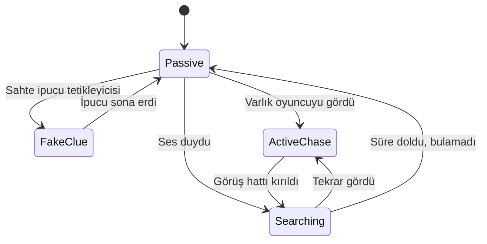
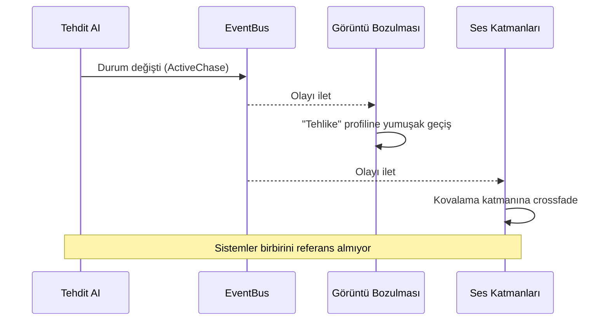

# Unlisted

Birinci şahıs, kısa ve atmosferik bir liminal space korku oyunu — Unity 6 / URP ile geliştirilmektedir.

> Sıradan bir mesai gününde, ofis binasının merdiven boşluğunda gerçekliğin dışına düşüyorsun. Sonu gelmeyen koridorlar, güvenilmez floresan ışıklar ve elinde pili giderek azalan bir fener. Çıkışı bulmak için kendine ait olanı geri toplaman gerekiyor — ama bina, senin burada hiç var olmadığından emin görünüyor.

## İçindekiler

- [Genel Bakış](#genel-bakış)
- [Tema](#tema)
- [Öne Çıkan Özellikler](#öne-çıkan-özellikler)
- [Mimari ve Teknik Detaylar](#mimari-ve-teknik-detaylar)
- [Kullanılan Teknolojiler](#kullanılan-teknolojiler)
- [Kurulum](#kurulum)
- [Kontroller](#kontroller)
---

## Genel Bakış

**Unlisted**, solo geliştirilen, yaklaşık **45-50 dakikalık**, baştan sona oynanıp bitirilebilecek şekilde kapsamı bilinçli olarak küçük tutulmuş bir korku oyunudur. Backrooms / liminal space estetiğinden ilham alır; ancak salt "kaç ve saklan" döngüsüne indirgenmek yerine **keşif, obje toplama, çevresel anlatı ve kaynak (fener pili) yönetimini** bir arada sunar.

## Tema

Oyunun tüm tasarım kararlarına rehberlik eden ana metafor: **görünmez olmak / silinmek.**

- Toplanan objeler bir çıkış anahtarı değil, karakterin **kimliğinin parçaları** (cüzdan, kimlik kartı, bir fotoğraf, bir mektup parçası)
- Notlar, günlükler ve çevredeki ipuçları oyuncuya kendi varlığını sorgulatacak şekilde yazılır
- Işık bile güvenilir değildir: ortam lambaları rastgele titrer ve kalıcı olarak söner; tek dayanak olan fenerin de pili sınırlıdır
- Tehdit her zaman gerçek değildir — sahte ipuçlarıyla gerçek varlık aynı ses ve görüntü dilini kullanır, oyuncu hangisinin hangisi olduğunu ayırt edemez

## Öne Çıkan Özellikler

### Level Yapısı

- **"Deforme olan" bir merkez (Hub):** oyunun başladığı ofis/merdiven boşluğu alanı
- Dört ana oda (Hub, Çalışma Alanı, Mola Alanı, Mekanik Alan) **tek uzun bir ana koridor/omurga** ile sırayla bağlanır; her ana oda bir kimlik parçası ve artan bir tehdit seviyesi taşır
- Ana omurga bilinçli olarak **kapısız ve boş** bırakılmıştır — boşluk tekinsizliği artırır
- Yan koridorlar **kapılıdır** ve oyuncuya bilinçli bir seçim anı yaratır:
  - **Fake Room'lar:** oyunla ve birbirleriyle bilerek bağlantısız görünen, oyuncunun kafasını karıştırmak için tasarlanmış odalar (bazılarında gerçek ipuçları gizli)
  - **Normal Odalar:** opsiyonel bulmaca + hikâye + ekstra kaynak (fener pili) barındıran odalar

### Tehdit Sistemi

- Çoklu devriye gezen düşmanlar yerine **tek bir Varlık**
- Durum makinesi tabanlı davranış: devriye → (görüş) aktif kovalama → (görüş kaybı) arama → devriye
- Görüşün yanında **işitsel algılama**
- Oyuncu eğildiğinde algılanma menzili ve açısı düşer
- Tasarımcı tarafından odalara verilen etiketlerle (sahte / pasif / aktif) kontrol edilen **tırmanan yoğunluk**: ilk bölgelerde sadece sahte ipuçları, ilerledikçe gerçek varlık ve kovalamalar

### HUD'suz, Diegetik Geri Bildirim

- **Fener pili:** sayısal gösterge yok — pil durumu ışığın kendi davranışıyla (sönükleşme, titreme) hissettirilir; pil envantere düşer ve oyuncu tarafından **manuel olarak** takılır
- **Stamina:** ekranda bar yok — tükendiğinde karakter otomatik yürümeye geçer ve nefes nefese kalma sesi duyulur
- **Kafa sallanması (head bob):** yürüme/koşmaya göre hafif kamera hareketi

### Atmosfer ve Görsel Dil

- URP Post-Processing Volume tabanlı **"insan gözü + analog bozulma"** görünümü (Film Grain, Chromatic Aberration, Vignette, Lens Distortion, Color Adjustments, Bloom)
- Görüntü bozulmasının yoğunluğu, tehdit durumuna bağlı olarak (Sakin / Tedirginlik / Tehlike) **otomatik ve yumuşak geçişlerle** değişir
- **Tekrar kullanılabilir floresan armatür sistemi:**
  - Armatür başına rastgele ışık gücü
  - Bir kısmının rastgele titreyebilmesi
  - Oyuncu belirli bir noktayı geçtiğinde tetiklenen kalıcı "lamba söner" olayı (ses + çırpınma + kalıcı sönme)
- Işık havuzları arasında bilinçli olarak **gerçek karanlık** bırakılır

### Anlatı Sistemleri

- **Kimlik parçaları ve çıkış:** dört parça tamamlanmadan çıkış asansörü oyuncuyu reddeder (kamera sarsıntısı + ses uyarısı); parçalar tamamlanınca final sekansı başlar
- **Günlük sistemi:** okunan tüm notlar `Tab` ile açılan, kaydırılabilir bir günlükte tekrar okunabilir
- **İnteraktif objeler:** ör. açılıp incelenebilen cüzdan paneli, kapatılınca tetiklenen kişisel altyazı
- **Sinematik an sistemi:** bir tetikleyiciye girildiğinde kamera FOV'u yumuşakça daralır, oyuncu kontrolü (hareket, bakış, etkileşim, adım sesi, kafa sallanması) geçici olarak kilitlenir ve sıralı altyazılar oynatılır — tamamen tekrar kullanılabilir

### Fake Room Örneği

İlk Fake Room'da oyuncu koridordan sıcak, ev gibi bir oda görür. İçeri girdiğinde, önce lamba titremesi ve görüntü bozulmasıyla gelen bir ön belirti, ardından aşamalı bir göz kırpma ve fiziksel bir darbe (kamera sarsıntısı + ses) ile oda bir ofise dönüşür — ev eşyalarının olduğu yerlerde sadece lekeler ve izler kalır.

## Mimari ve Teknik Detaylar

| Kalıp / Yaklaşım                     | Kullanım Alanı                                                                                                   |
| ------------------------------------ | ---------------------------------------------------------------------------------------------------------------- |
| **Event Bus**                        | Sistemler arası, birbirinden habersiz iletişim (tehdit durumu değişimi, etkileşimler, anlatı olayları)          |
| **State Machine**                    | Tehdit AI davranışları ve tehdit durumuna bağlı görüntü/atmosfer geçişleri                                       |
| **Tekrar kullanılabilir bileşenler** | Floresan armatür, sinematik an, eşya toplama (`ItemPickup`) — yeni içerik için yeni script yerine yapılandırma |
| **Tasarımcı odaklı tetikleyiciler**  | Oda/segment etiketleriyle tehdit yoğunluğu ve olayların Inspector'dan kontrolü                                  |

### Level Akışı

### Tehdit Durum Akışı

### Tehdit Durumu → Atmosfer Bağlantısı

Görüntü bozulması sistemi tehdit AI'ını doğrudan tanımaz; sadece durum değişikliği olaylarını dinler:

## Kullanılan Teknolojiler

- **Motor:** Unity 6 LTS (6000.3.22f1)
- **Render Pipeline:** Universal Render Pipeline (URP)
- **Dil:** C#
- **Versiyon Kontrolü:** Git / GitHub

## Kurulum

1. [Unity Hub](https://unity.com/download) üzerinden Unity 6000.3.22f1 (ya da uyumlu bir 6 LTS sürümü) kurulu olmalı
2. Bu repoyu klonlayın
3. Unity Hub'dan "Add project from disk" ile proje klasörünü açın
4. `Assets/_Project/Scenes/[gameScene].unity` sahnesini açıp Play'e basın

## Kontroller

| Tuş                  | Aksiyon                       |
| -------------------- | ----------------------------- |
| `W A S D`            | Hareket                       |
| `Shift` (basılı tut) | Koşma                         |
| `CTRL`               | Eğilme                        |
| `E`                  | Etkileşim / eşya toplama      |
| `F`                  | Feneri aç/kapat               |
| `R`                  | Feneri pille doldurma         |
| `Tab`                | Günlüğü aç/kapat              |
| `Esc`                | Duraklat                      |

---

_Bu proje, bitirilip yayınlanması hedeflenen kişisel bir oyun projesi ve portfolyo çalışması olarak geliştirilmektedir._
